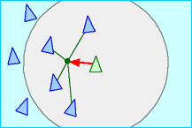

# Boids

## Concept

Boids is an artificial life program, developed by Craig Reynolds in 1986, which simulates the flocking behaviour of birds.

## Boid's neighborhood 

## Rules applied

| Rules | Explanation |
| --- | :-----: |
| | Cohesion: steer to move toward the average position of local flockmates |
| | Separation: steer to avoid crowding local flockmates |
|  | Alignment: steer towards the average heading of local flockmates |

Based on [Craig Reynold paper](https://www.red3d.com/cwr/boids/)